# 🎡 2022 年活動紀錄



### 0101．猜五元素



### 01．項目發售

<figure>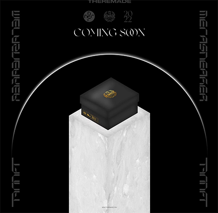<figcaption></figcaption></figure>



### 01．早安晨之美

### 02．母親節創作活動

<figure>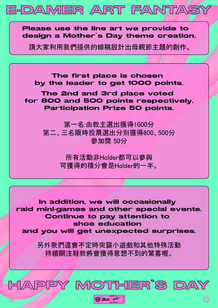<figcaption></figcaption></figure>

### 03．貼圖創作大賽

<figure>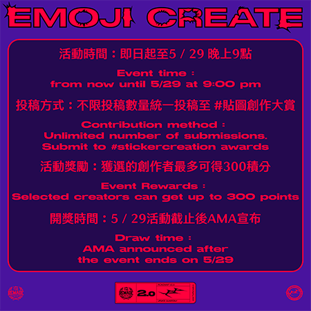<figcaption></figcaption></figure>

### 04．票選第一雙鞋

<figure><figcaption></figcaption></figure>



### 線上活動：

#### 01．寶博朋友說 Podcast

{% embed url="https://podcasts.apple.com/tw/podcast/ep139-%E9%80%99%E5%80%8Bnft%E8%B2%B7%E4%BA%86%E7%B5%82%E8%BA%AB%E9%A0%98%E9%9E%8B-ft-the-remade-nft-founder-tommy-chen/id1484923390?i=1000565566223" %}

#### 02．分享你最愛的 TR 鞋

#### 03．NFT輕鬆聊 Podcast

{% embed url="https://podcasts.apple.com/us/podcast/ep3-%E6%AF%8F-3-%E5%80%8B%E6%9C%88%E5%B0%B1%E5%8F%AF%E4%BB%A5%E5%85%8D%E8%B2%BB%E9%A0%98%E4%B8%80%E9%9B%99%E6%BD%AE%E6%B5%81%E9%9E%8B-ft-the-remade-%E5%89%B5%E8%BE%A6%E4%BA%BA-tommy/id1627721024?i=1000566704284" %}

#### 04．邀請賽

<figure>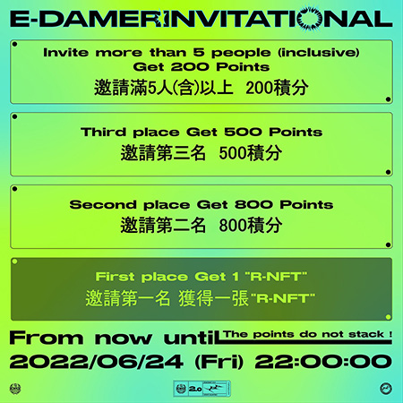<figcaption></figcaption></figure>

#### 05．雙持有者空投

### 線下活動：

#### 01．TR 首次線下聚 “Sneakerverse” Exclusive Party

<figure>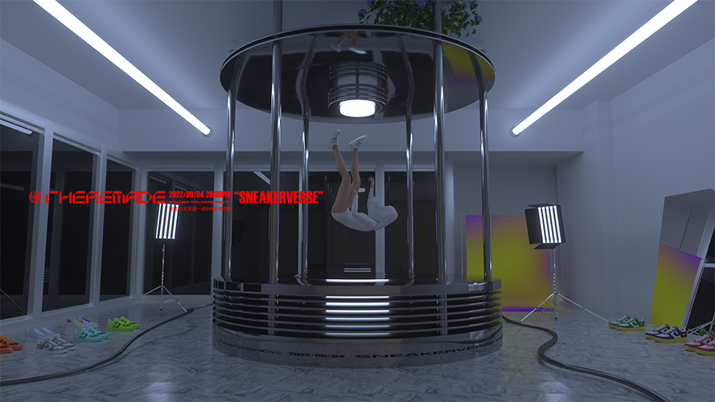<figcaption></figcaption></figure>

#### 02．NFT NYC

<figure>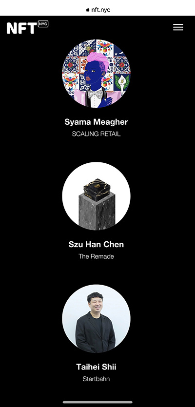<figcaption></figcaption></figure>

#### 03．眼鏡開幕派對



### 線上活動：

#### 01．七夕情人節活動

<figure>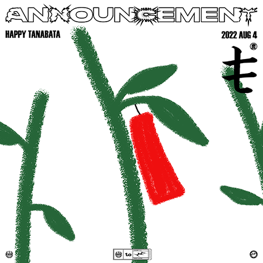<figcaption></figcaption></figure>

#### 02．主題討論版

<figure>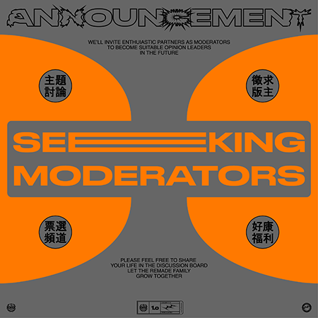<figcaption></figcaption></figure>

### 線下活動：

01．萬寶華活動

<figure>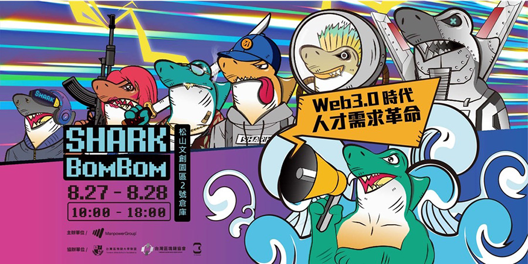<figcaption></figcaption></figure>



### 線上活動：

#### 01．穿搭開箱活動

<figure>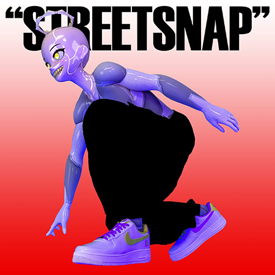<figcaption></figcaption></figure>

#### 02．官網 2.0

<figure>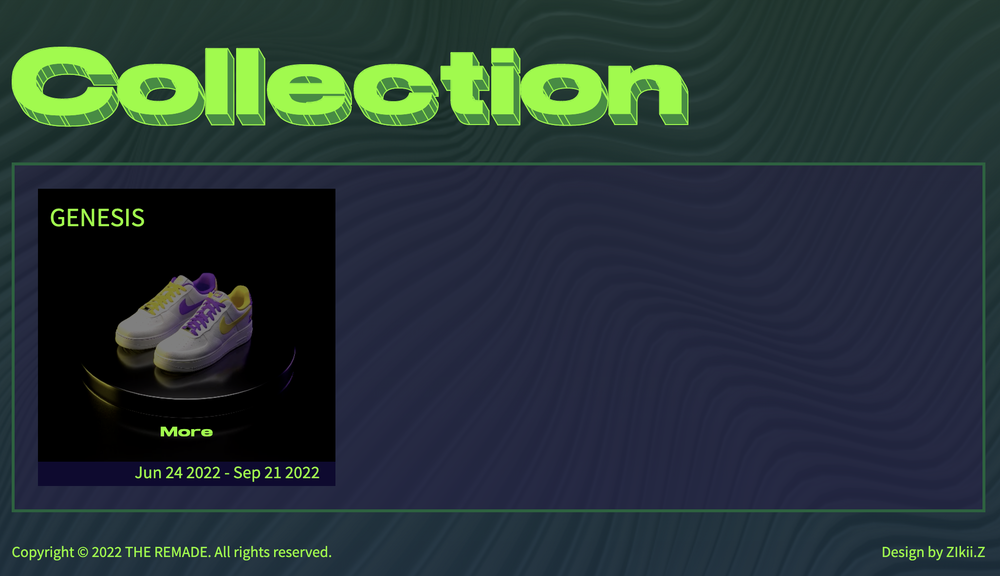<figcaption></figcaption></figure>

#### 03．STEVE NASH 合作

### 線下活動：

#### 01．CloneX TW線下聚

<figure>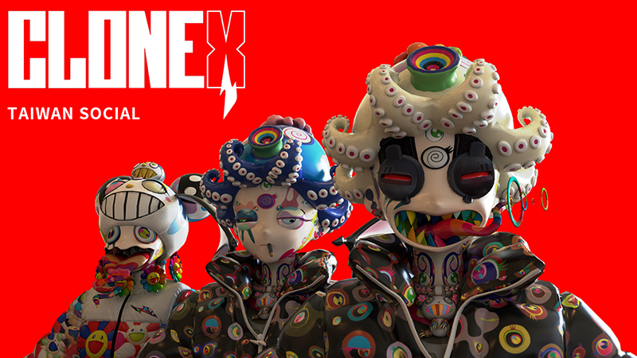<figcaption></figcaption></figure>

#### 02．Silicon Slopes

<figure>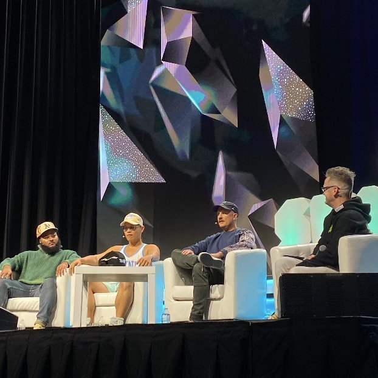<figcaption></figcaption></figure>



### 線上活動：

#### 01．萬聖節頭像活動

<figure>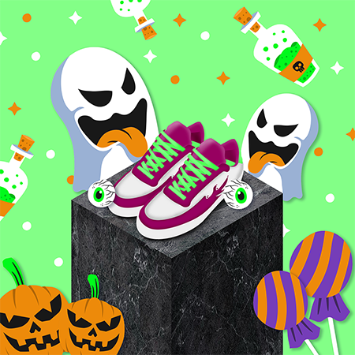<figcaption></figcaption></figure>

#### 02．Steve Nash 精彩瞬間

<figure>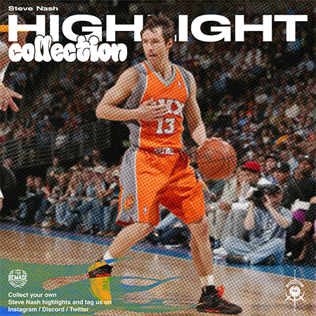<figcaption></figcaption></figure>

### 線下活動：

#### 01．C-Cubed 籃球比賽

<figure>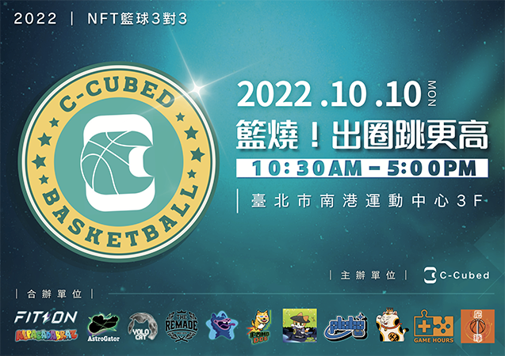<figcaption></figcaption></figure>

#### 02．halfway聯合萬聖節活動

<figure>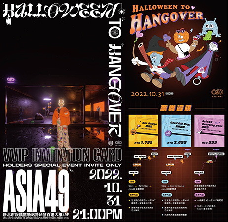<figcaption></figcaption></figure>

#### 03．Dallas SneakerCon



### 線上活動：

二月份：猜五元素

三月份：項目發售

五月份：早安晨之美、母親節創作活動、貼圖創作大賽、票選第一雙鞋

六月份：寶博朋友說 Podcast、分享你最愛的 TR 鞋、NFT輕鬆聊 Podcast、邀請賽、雙持有者空投

八月份：七夕情人節活動、主題討論版

九月份：穿搭開箱活動、官網 2.0、STEVE NASH 合作

十月份：萬聖節頭像活動、Steve Nash 精彩瞬間

十二月份：世足競猜

### 線下活動：

六月份：TR 首次線下聚 “Sneakerverse”Exclusive Party、NFT NYC、眼鏡開幕派對

八月份：萬寶華活動

九月份：CloneX TW線下聚、Silicon Slopes

十月份：C-Cubed 籃球比賽、halfway聯合萬聖節活動、Dallas SneakerCon

十一月份：周湯豪演唱會、DesignerCon LA、Art Basel Miami

十二月份：OneOffs、NFT Taipei、CloneX TW Year End Party、CloneX Tokyo、年末 TR 線下聚
