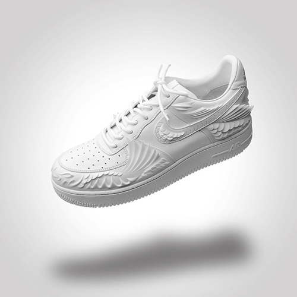

# 📓 About The Remade

The founder Tommy himself is a veteran sneaker collector, but after chasing the market for a while, he found that instead of chasing other people's limited-edition sneakers, it is better to design one-of-a-kind custom-made shoes. Later, it happened to catch up with the community craze, and everyone began to pursue "personalization", which made The Remade's creations catch the eyes of many celebrities and brands.

<figure><figcaption>
Air Force 1 “Chinese Koi”
</figcaption></figure>

### Customized sneakers for the Bucks, **Nick Chou** and other celebrities

THE REMADE has customized exclusive sneakers for many international celebrities, such as Chris Brown, Nelly, Nick Chou, etc.; and the more well-known recent works are commemorative shoes to celebrate the NBA "Milwaukee Bucks" winning the championship again after 50 years. .

In the photo, you can see that this pair of AJ1s is made of the Bucks color scheme, the body is luxuriously covered with rhinestones, the "Fear the Deer" team logo is printed on the inside, and the word CHAMPIONS is printed on the tongue. The workmanship is super fine! At the same time, this is also the first pair of championship shoes in the history of the NBA game, overturning the unwritten rule of only the championship ring in the past.

<figure><figcaption>
Bucks Championship Shoes
</figcaption></figure>

### It is no longer just a second creation, but will launch "brand original works" in the Metaverse

In the past, the custom-made sneakers designed by Tommy Chen, the manager of THE REMADE, first bought the official originals of brands such as Nike and Adidas, and then created them through graffiti, laser carving, skin changing, and even 3D printing. The "THE REMADE: E-DAMER" NFT to be launched in the Metaverse also adheres to the principles of "customization" and "uniqueness", but the shoe body itself should be entirely handmade, that is, THE REMADE may launch a "Brand Original Work".

<figure><figcaption>
RE：DREAMER shoes
</figcaption></figure>
