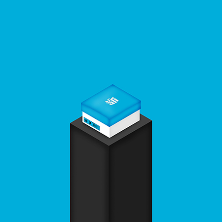

# 🤜 Legendary 系列

透過 OpenSea 可以發現項目有 520 張 NFT，但實際發售的卻只有 500 張，因為前 20 張是 Legendary 系列。該系列是預留給未來合作項目的位置，目前已經釋出前 10 張的合作項目。

### **已公布的** Legendary

<figure><figcaption></figcaption></figure>

#### #5 Sneaker News

Sneaker News 是一個運動鞋媒體平台，每天報導最令人垂涎​​的運動鞋和市場上最新的運動鞋。 除了定期更新最新消息外，Sneaker News 還提供有用的資源來幫助全球消費者進行購買。Sneaker News 被認為是球鞋界最值得信賴和權威的聲音。

### 未公布的 Legendary

<figure><figcaption>
Token ID 1
</figcaption></figure>

 

<figure><figcaption>
Token ID 2
</figcaption></figure>

<figure><figcaption>
Token ID 3
</figcaption></figure>

 

<figure><figcaption>
Token ID 4
</figcaption></figure>

<figure><figcaption>
Token ID 6
</figcaption></figure>

 

<figure><figcaption></figcaption></figure>

<figure><figcaption>
Token ID 8
</figcaption></figure>

 

<figure><figcaption></figcaption></figure>

<figure><figcaption>
Token ID 10
</figcaption></figure>

 

<figure><figcaption>
Token ID 11~20
</figcaption></figure>

