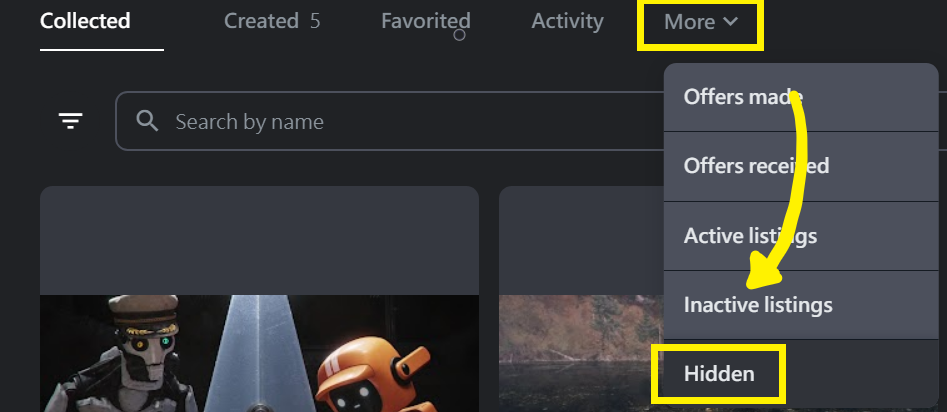

# 🎙 Discord 社群 AMA 纪录

### 2022



* 主题讨论版票选前三名：NFT News 版、Training 版、球鞋讨论版。&#x20;
* 可以到 #🦖． topicdiscussion 提名版主，提名到 8 月 24 日，版主确认后就会开启频道。&#x20;
* 额外增设新奇版，由 Dabasa 来担任版主&#x20;
* 担任版主后，会与 MOD 一起讨论后续的合作与发展。&#x20;
* 九月初社群会有小活动，希望大家多分享收到的鞋子到推特或IG上。
* 未来预计会举办线下小聚会，穿着兑换的球鞋来参加说不定会有小惊喜。&#x20;
* 目前与多个项目在谈合作，希望在熊市的状况下，各项目之间能够有更密切的连结和互动。&#x20;
* 大宝对目前 NFT 市场的个人见解，可以听录音档 29 分 25 秒开始，约 3 分钟。&#x20;
* 8/27-28 大宝将代表 The Remade 进行演讲介绍，活动名称：台湾下一步：Web3.0 时代人才需求革命策展，地点：松烟文创园区，现场会有摊位展示这次兑换的实体鞋，与 NFT 贩卖机。&#x20;
* 8/13 - 8/28 豹与羊驼艺术展 地点：华山文创园区 （延长到 9/7） https://www.taishinbank.com.tw/TSB/personal/common/bonus/TSBankBonus-001146/&#x20;
* 第一批约 90 双球鞋已经抵达台湾，预计在 8 月 22 日开始寄出，后续预计每周都会有兑换的球鞋送达台湾并寄出给各位。&#x20;
* E-DAMER 是 THE REMADE 的 WEB3 品牌，E-DAMER 是 REMADE 的倒装单字，命名上的小细节。&#x20;
* 下一季的球鞋目前已经有雏型了，也可以到 #🔮． discuss-design 许愿或是提供想法&#x20;
* 男模特跟女模特都有人报名，目前还缺摄影师，如果有鞋友是摄影师欢迎开票报名



* REMADE大事纪回顾 **🎬┃roadmap**&#x20;
* Johnny 是非常厉害的设计师，曾跟村上隆合作过，后续我们也会跟他有相关合作，可以先关注他的 Twitter。 https://twitter.com/johnnyx\_nft&#x20;
* 8/13 - 8/28 豹与羊驼艺术展 地点：华山文创园区 https://www.taishinbank.com.tw/TSB/personal/common/bonus/TSBankBonus-001146/&#x20;
* 8/27-8/28 台湾下一步：Web3.0 时代人才需求革命策展 地点：松烟文创园区 https://www.accupass.com/event/2208091147261843480590 E-DAMER&#x20;
* 兑换网站未来会进行改版优化，敬请期待！&#x20;
* 第一批兑换球鞋已经在路上，感谢大家耐心等候！&#x20;
* THE REMADE／RE:DREAMER 团队成员介绍：
  1. Dabao：THE REMADE 社群负责人，管理 MOD 工作、整合社群内外资讯及重要事项公告！&#x20;
  2. Chad：社群首席电台哥，主管 DC 社群开票大小事问题回覆、NOTION 资料总整理、活动策画。&#x20;
  3. Brian：处理鞋子从工厂进口、台湾仓储、活动策画。&#x20;
  4. Haru：TWITTER、IG 等社群内容、活动策画、活动策画。&#x20;
  5. 沉欢：THE REMADE 首席设计师，负责替大家设计所有帅气的专属鞋款及形像图。
* 社群中有许多有各种资源的创业者朋友在做很酷的事情，例如 NFT 显示器、球鞋清洁店等，希望社群内可以多互相交流分享资源，或者有任何跟 THE REMADE 合作建议，欢迎跟大宝联络！&#x20;
* 教主计画 Sneak Peak：
  1. 与蓝筹项目持有者社群做非官方的合作计画&#x20;
  2. 预计九月会到 NIKE 美国总部开会&#x20;
  3. 预计九月参加米兰时装周&#x20;
  4. 预计十月参加其他国际时尚展览&#x20;
  5. 投资 lablaco 义大利公司

目标打造只有明星跟持有者才穿的到的鞋子，大家一起把 E-DAMER 推向国际！



### Q & A部分

Q1：REDEEM 兑换流程建议改善&#x20;

A1：

1. 开启一个搜集大家建议的频道，以利改善
2. 在兑换的页面，把尺码对照表放上去，一目了然
3. 线上出货进度查询，目前还没有线上化的动作，已经在写资料查询系统

Q2：下次AMA会在什么时候？

A2：预计八月中在收到鞋子后

Q3：目前出货进度如何？未来是否愿意提供身分证字号供出货使用？&#x20;

A3：因为卡在 EZWAY 的关系，目前预计八月中左右会让大家收到 统计结果: 大家不愿意提供身分证字号，8票同意，10票反对，所以暂订未来以不搜集身分证字号为原则，采统一集中到台湾仓库后转寄方式出货

Q4：下次线下聚是什么时候？&#x20;

A4：教主还在美国持续推广 THE REMADE，所以下次的线下聚应该会由大宝来主持，时间待讨论

Q5：可以请教主分享保护鞋子及清洁的小工具吗？ （鞋盒或清洁剂等）

A5：会请教主多分享，大家有好的方法也可以多分享

Q6：下一季的鞋子什么时候开始设计？&#x20;

A6：下一季鞋款预计会在八月开始设计，大家如果有什么特别的IDEA都可以提出，或许有机会从中选出热门的款式去制作成鞋子

### 资讯更新

01、未来除了一个 RNFT 就可以兑换的鞋子外，也会推出需要多个 RNFT 才可以兑换的特殊款鞋子或商品！&#x20;

02、若想查询自己有没有 REDEEM 成功，可以到频道查询 #📦┃redeem-events&#x20;

03、未来与 SNEAKER NEWS 有更密切的合作，或许有联合 AMA，敬请期待&#x20;

04、移动 E-DAMER 会重新计算90天，移动 RNFT 则无影响&#x20;

05、未来会开立主题讨论区，让大家可以有更多延伸讨论，大家提出有兴趣的板（大家提到的：干话版、美女版、电影版、P+ league版、宠物版等等），版主也会有特别好康的礼物&#x20;

06、大家收到鞋子之后，预计还会办一个活动，敬请期待&#x20;

07、本次寄出鞋盒中有特别的小惊喜，敬请期待&#x20;

08、之前的邀请活动及推特活动均已完成空投&#x20;

09、教主持续在国外推广 THE REMADE，且会参加 NFT LONDON 大会去用力推广品牌，请大家也多多努力把 THE REMADE 推广出去吧&#x20;

10、COOLWALLET 目前还是有遇到技术上的问题，LEDGER 似乎有人可以 REDEEM，但冷钱包使用者，目前还是建议先用热钱包做兑换。



01、丹宁款最终确认为浅色版丹宁。

&#x20;02、满 90 天的 RNFT 及 ASRNFT 都已空投完毕，若经由 Opensea 请到 Hidden 查看。

<figure><figcaption></figcaption></figure>

03、兑换网站及教学已开放，请到 **🔗┃official-links** 进入官网并参考 **🎟┃how-to-redeem** 兑换。&#x20;

04、一定要先切换到 Polygon 链后再在官网登入才能兑换，切换 Polygon 教学可参阅 **💜｜polygon-eth**。&#x20;

05、尺码可参考 Nile 官网来选择或直接至实体店面试穿 Air Force 1。 https://www.nike.com/size-fit/mens-footwear\
06、已兑换的 RNFT 会被 burned 无法再被使用。&#x20;

07、之后将开放持有 RNFT 及 ASRNFT 者皆可以看到**🧬┃process-参与创作进程**。&#x20;

08、所有可兑换款式皆已完成，可以到**🧬┃process-参与创作进**程 参考实体照进行选择。&#x20;

09、持有 90 天已重新开始计算，若需要更换至冷钱包的持有者可以进行了。&#x20;

10、近期会整理详细版兑换流程及新版 QA 请再给我们一点时间更新。&#x20;

11、邀请比赛已截止，我们会花两到三天的时间排除机器人后公布得主。


