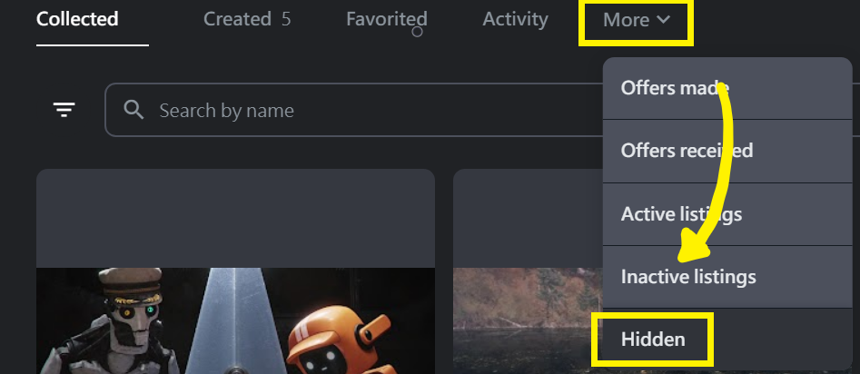

# 🎙 Discord 社群 AMA 紀錄

### 2022



* 主題討論版票選前三名：NFT News 版、Training 版、球鞋討論版。
* 可以到 **#🦖．topicdiscussion** 提名版主，提名到 8 月 24 日，版主確認後就會開啟頻道。
* 額外增設新奇版，由 Dabasa 來擔任版主
* 擔任版主後，會與 MOD 一起討論後續的合作與發展。
* 九月初社群會有小活動，希望大家多分享收到的鞋子到推特或IG上。
* 未來預計會舉辦線下小聚會，穿著兌換的球鞋來參加說不定會有小驚喜。
* 目前與多個項目在談合作，希望在熊市的狀況下，各項目之間能夠有更密切的連結和互動。
* 大寶對目前 NFT 市場的個人見解，可以聽錄音檔 29 分 25 秒開始，約 3 分鐘。
* 8/27-28 大寶將代表 The Remade 進行演講介紹，活動名稱：台灣下一步：Web3.0 時代人才需求革命策展，地點：松菸文創園區，現場會有攤位展示這次兌換的實體鞋，與 NFT 販賣機。
* 8/13 - 8/28 豹與羊駝藝術展 地點：華山文創園區 （延長到 9/7） https://www.taishinbank.com.tw/TSB/personal/common/bonus/TSBankBonus-001146/
* 第一批約 90 雙球鞋已經抵達台灣，預計在 8 月 22 日開始寄出，後續預計每周都會有兌換的球鞋送達台灣並寄出給各位。
* E-DAMER 是 THE REMADE 的 WEB3 品牌，E-DAMER 是 REMADE 的倒裝單字，命名上的小細節。
* 下一季的球鞋目前已經有雛型了，也可以到 **#🔮．discuss-design** 許願或是提供想法
* 男模特跟女模特都有人報名，目前還缺攝影師，如果有鞋友是攝影師歡迎開票報名



* REMADE大事紀回顧 🎬┃roadmap
* Johnny 是非常厲害的設計師，曾跟村上隆合作過，後續我們也會跟他有相關合作，可以先關注他的 Twitter。 [https://twitter.com/johnnyx\_nft](https://twitter.com/johnnyx\_nft)
* 8/13 - 8/28 豹與羊駝藝術展 地點：華山文創園區 [https://www.taishinbank.com.tw/TSB/personal/common/bonus/TSBankBonus-001146/](https://www.taishinbank.com.tw/TSB/personal/common/bonus/TSBankBonus-001146/)
* 8/27-8/28 台灣下一步：Web3.0 時代人才需求革命策展 地點：松菸文創園區 [https://www.accupass.com/event/2208091147261843480590](https://www.accupass.com/event/2208091147261843480590)
* E-DAMER 兌換網站未來會進行改版優化，敬請期待！
* 第一批兌換球鞋已經在路上，感謝大家耐心等候！
* THE REMADE／RE:DREAMER 團隊成員介紹：
  1. Dabao：THE REMADE 社群負責人，管理 MOD 工作、整合社群內外資訊及重要事項公告！
  2. Chad：社群首席電台哥，主管 DC 社群開票大小事問題回覆、NOTION 資料總整理、活動策畫。
  3. Brian：處理鞋子從工廠進口、台灣倉儲、活動策畫。
  4. Haru：TWITTER、IG 等社群內容、活動策畫、活動策畫。
  5. 沈歡：THE REMADE 首席設計師，負責替大家設計所有帥氣的專屬鞋款及形像圖。
* 社群中有許多有各種資源的創業者朋友在做很酷的事情，例如 NFT 顯示器、球鞋清潔店等，希望社群內可以多互相交流分享資源，或者有任何跟 THE REMADE 合作建議，歡迎跟大寶聯絡！
* 教主計畫 Sneak Peak：
  1. 與藍籌項目持有者社群做非官方的合作計畫
  2. 預計九月會到 NIKE 美國總部開會
  3. 預計九月參加米蘭時裝週
  4. 預計十月參加其他國際時尚展覽
  5. 投資 lablaco 義大利公司

目標打造只有明星跟持有者才穿的到的鞋子，大家一起把 E-DAMER 推向國際！



### Q & A部分

Q1：REDEEM 兌換流程建議改善&#x20;

A1：

1. 開啟一個蒐集大家建議的頻道，以利改善
2. 在兌換的頁面，把尺碼對照表放上去，一目了然
3. 線上出貨進度查詢，目前還沒有線上化的動作，已經在寫資料查詢系統

Q2：下次AMA會在什麼時候？

A2：預計八月中在收到鞋子後

Q3：目前出貨進度如何？未來是否願意提供身分證字號供出貨使用？&#x20;

A3: 因為卡在 EZWAY 的關係，目前預計八月中左右會讓大家收到 統計結果: 大家不願意提供身分證字號，8票同意，10票反對，所以暫訂未來以不蒐集身分證字號為原則，採統一集中到台灣倉庫後轉寄方式出貨

Q4：下次線下聚是什麼時候？&#x20;

A4：教主還在美國持續推廣 THE REMADE，所以下次的線下聚應該會由大寶來主持，時間待討論

Q5：可以請教主分享保護鞋子及清潔的小工具嗎？ （鞋盒或清潔劑等）&#x20;

A5：會請教主多分享，大家有好的方法也可以多分享

Q6：下一季的鞋子什麼時候開始設計？&#x20;

A6: 下一季鞋款預計會在八月開始設計，大家如果有什麼特別的IDEA都可以提出，或許有機會從中選出熱門的款式去製作成鞋子

### 資訊更新

01、未來除了一個 RNFT 就可以兌換的鞋子外，也會推出需要多個 RNFT 才可以兌換的特殊款鞋子或商品！

02、若想查詢自己有沒有 REDEEM 成功，可以到頻道查詢 #**📦┃redeem-events**

03、**未來與 SNEAKER NEWS 有更密切的合作**，或許有聯合 AMA，敬請期待

04、移動 E-DAMER 會重新計算90天，移動 RNFT 則無影響

05、**未來會開立主題討論區，讓大家可以有更多延伸討論**，大家提出有興趣的板（大家提到的：幹話版、美女版、電影版、P+ league版、寵物版等等），版主也會有特別好康的禮物

06、大家收到鞋子之後，預計還會辦一個活動，敬請期待

07、本次寄出鞋盒中有**特別的小驚喜**，敬請期待

08、之前的邀請活動及推特活動均已完成空投

09、教主持續在國外推廣 THE REMADE，且會參加 NFT LONDON 大會去用力推廣品牌，請大家也多多努力把 THE REMADE 推廣出去吧

10、COOLWALLET 目前還是有遇到技術上的問題，LEDGER 似乎有人可以 REDEEM，但冷錢包使用者，**目前還是建議先用熱錢包做兌換**。



01、丹寧款最終確認為**淺色版丹寧**。

02、**滿 90 天的 RNFT 及 ASRNFT 都已空投完畢，若經由 Opensea 請到 Hidden 查看**。

<figure><figcaption></figcaption></figure>

03、兌換網站及教學已開放，請到 🔗┃**official-links** 進入官網並參考 🎟┃**how-to-redeem** 兌換。

04、一定要先切換到 **Polygon 鏈**後再在官網登入才能兌換，切換 Polygon 教學可參閱 💜｜**polygon-eth**。

05、尺碼可參考 Nile 官網來選擇或直接至實體店面試穿 Air Force 1。

&#x20;[https://www.nike.com/size-fit/mens-footwear](https://www.nike.com/size-fit/mens-footwear) &#x20;

06、已兌換的 RNFT 會被 burned 無法再被使用。

07、之後將開放持有 RNFT 及 ASRNFT 者皆可以看到🧬┃**process-參與創作進程**。

08、所有可兌換款式皆已完成，可以到🧬┃**process-參與創作進程** 參考實體照進行選擇。

09、持有 90 天已重新開始計算，若需要更換至冷錢包的持有者可以進行了。

10、近期會整理詳細版兌換流程及新版 QA 請再給我們一點時間更新。

11、邀請比賽已截止，我們會花兩到三天的時間排除機器人後公佈得主。


