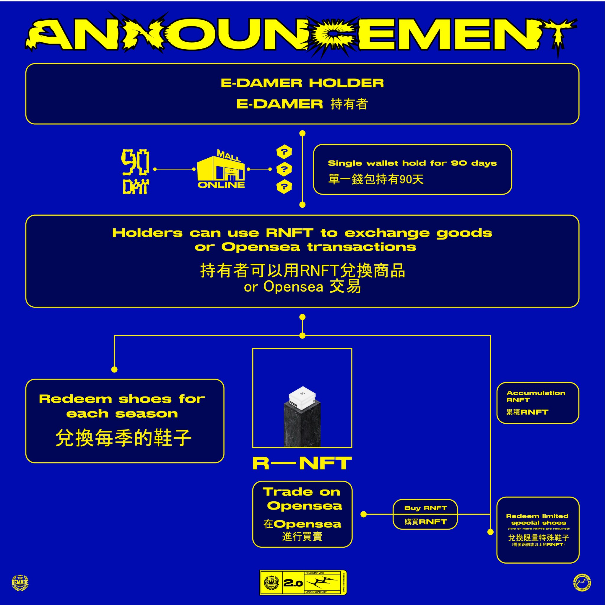

# ❓ E-DAMER 問與答

### 01、什麼是 E-DAMER NFT？

E-DAMER 是由 The Remade 項目方發行的NFT，每持有90 天產生出一張 RNFT 並可以用來兌換實體客製球鞋或其他商品的項目，永久有效。 持有 NFT 也可參與 Discord 社群互動及球鞋的製程。

### 02、什麼是 RNFT?

RNFT 是由 RE:DREAMER Lab 所設計一套新的 NFT 兌換協議，並實現對應 Web3 原生 Saas 服務。可以理解成一個兌換式的 NFT (像是商城的代幣)，當 E-DAMER 被確認連續持有滿 90 天后會自動空投 RNFT 到錢包 (Polygon 鏈)，可以使用 RNFT 兌換當季商品，也可以保留並累積多個 RNFT 兌換特殊商品，甚至可以在 OpenSea 上交易增加持有量。

<figure><figcaption>
E-DAMER 運作方式
</figcaption></figure>

### 03、如何兌換鞋子？ Size 可以選嗎？其他國家有寄送嗎 ?

前往官方商城網站，使用 RNFT 兌換，同時可選擇要兌換的尺寸。 **包裹全球皆可寄送**。

### 04、每 90 天可以得到的鞋子款式是什麼？

**空投前會公佈當季可兌換的鞋款和兌換期限**，每季提供鞋款的總量約為 500 雙，可能是一款 500 雙，或者是兩款各 200 多雙等，也會有聯名款等特殊鞋款公佈並讓大家用 2 個或以上的 RNFT 兌換，當越稀有的鞋款被公佈時持有者手上的 RNFT 就會越值錢。 只有 E-DAMER 可以產生 RNFT 來兌換這些鞋款，而即使是非 E-DAMER 的持有者，只要有足夠的 RNFT，也可以兌換鞋子。 不會限定每季可兌換的數量，利用 RNFT 的稀缺性來增加在二級市場的流動性與價值。

<figure><figcaption>
第一季（06/24～9/21）兌換鞋款
</figcaption></figure>

### 05、取得 RNFT 的方式有哪些？

**每 90 天最多只會有 500 個 RNFT，另外 20 個傳奇版不會產生 RNFT。** RNFT 取得管道，只有 E-DAMER 的 NFT 會生 RNFT 不會有其他的管道憑空出現 RNFT。除了持有 E-DAMER 之外，在 Discord 社群參與積分制活動，集滿 10,000 積分可以兌換 RNFT，並使用 RNFT 兌換商城中的商品。&#x20;


社群回饋的 RNFT 也是從 500 個裡面去空投


### 06、有哪些社群活動？

目前 Discord 社群有積分活動，之前舉辦過母親節創作比賽及貼圖創作大賞，母親節創作比賽讓社群成員一起發想以母親節為主題創作出心目中要送個母親的鞋子，E-DAMER 也會從中發掘設計，說不定有一天自己的設計也可能在商城中以 RNFT 兌換。 貼圖創作大賞為創作符合社群的貼圖，讓成員到別的社群時可以使用 E-DAMER 的貼圖推廣。&#x20;

**近期持續與其他知名項目進行聯合 AMA**，已觸及更多不同國家的人，讓社群未來有更多不一樣的發展。

### 07、如何參與鞋子的製程？

E-DAMER 會分享平常設計/鞋子製作的過程跟各種靈感為主題創作的鞋，同時目前第一季在 AMA 的過程中決定了 AF1 的鞋型，主題的部分多數人希望由 TOMMY 主導，而 TOMMY 提出了夏日配色，製作出了幾雙不同款式的鞋子，來讓社群持有者共同決定。 之前製作的極樂世界、RE:DREAMER 等的鞋子，是在創意發想的過程，希望大家給出想法或建議。

### 08、RNFT 無限產會不會導致供需不平衡 ?

持有者會擔心每 90 天產生的 RNFT 過多導致供需不平衡，實際上第一雙鞋亮相後 E-DAMER 只會被一直轉移，它產生的 RNFT 數量會比總量 500 少很多，相對可以控制 RNFT 的數量，讓初期持有者維持該有的權利。

### 09、RNFT 可以換幾次鞋子？

**只能兌換一次**，在兌換完成後會將 RNFT 燒掉。

### 10、有什麼實際的推廣行為嗎？

E-DAMER 六月中飛往紐約帶領團隊去 NFT NYC 推廣並當講者，並將第一雙鞋和 E-DAMER 推向國際。近期也有錄製「寶博朋友說」和「NFT輕鬆聊」等 Podcast 節目推廣項目。 九月前往 NFT LONDON 擔任講者推廣 E-DAMER ，結束後在歐洲參加時裝周等大小活動，持續推廣。

### 11、未來 Gen2 何時推動？

Gen2 目前規劃是等第一波空投做好後再來推動，先完成一開始所承諾的路線再來進行 Gen2 3D 鞋的部分。
