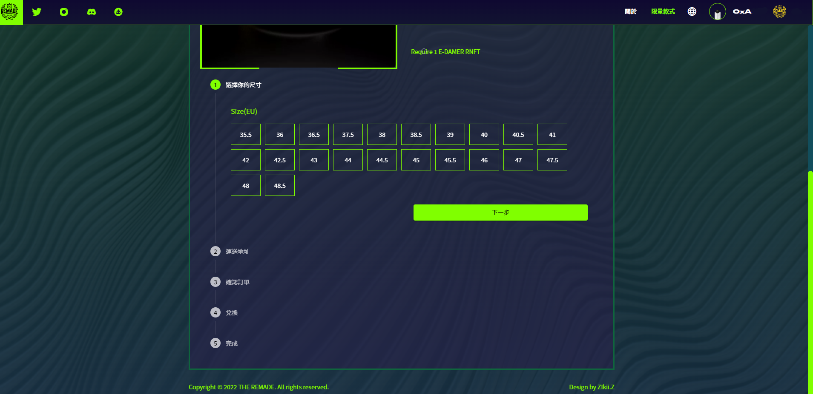

# ⚒ 关于 RNFT (兑换教学与QA)



### 第一步：进入官网后，点选右上角的连结钱包，就会进入下方的画面进行登入

<figure><figcaption></figcaption></figure>

### 第二步：登入后点选右上角的限量款式，就可以进入下方画面进行商品兑换

<figure><figcaption></figcaption></figure>

### 第三步：使用 RNFT 进行兑换

<figure><figcaption></figcaption></figure>

### 第四步：填写兑换尺寸与货运寄送地址，填写完成后会需要烧掉 RNFT，完成

<figure><figcaption></figcaption></figure>



### 01、请问怎么将钱包切换到 Polygon 链？&#x20;

可以参考 如何在钱包添加 Matic 币 页面

### 02、该如何知道适合自己的鞋码？&#x20;

第一季鞋款为 Air Force 1 拆改设计，可参考下表或直接到 NIKE 官网查询鞋码，也可至实体店面试穿该鞋款。  https://www.nike.com/size-fit/mens-footwear

<figure><figcaption></figcaption></figure>

### 03、请问鞋码是否有分男女鞋？需要备注吗？&#x20;

鞋码没有男女鞋之分，可以直接参考官网的尺码用 US 或 CM 去对应 EU。

### 04、兑换时显示没有足够的 MATIC 可进行交易该怎么解决？

&#x20;Matic 是 Polygon 链的原生代币就跟 ETH 在 Ethereum 链一样，可到交易所购买 MATIC 再转入存有 RNFT 的钱包里即可进行操作。

### 05、钱包内有Matic 但还是兑换失败该怎么办？例如下图的状况

<figure><figcaption></figcaption></figure>

建议调高 Gas 到 High 即可

### 06、兑换完成后哪里可以检查是否已兑换成功？&#x20;

兑换完成可以到官网查询。同时也可以在 Discord 里的 #redeem-events 检查是否出现自己的地址。

<figure><figcaption></figcaption></figure>

### 07、兑换后多久可以收到商品？&#x20;

按填写顺序陆续寄出，约 8 周左右会收到商品。

### 08、请问每次的鞋款是否有兑换期限？&#x20;

有，连结官网出现兑换页面后，将在每款鞋子图片底端显示兑换期限。

### 09、若 RNFT 过多是否可以保留到下一次兑换？&#x20;

可以，RNFT 无使用期限，若错过商品可将剩余 RNFT 保留至下次兑换。

### 10、如果有想换的鞋款但没有足够的 RNFT？&#x20;

可以到二级市场（OpenSea）购买。连结可以参考『官方连结』页面。

### 11、若尺码不小心选错是否可以更改？&#x20;

可以，请在兑换的当周六前开票并提供钱包地址及相关修改资料即可，逾时不受理。



