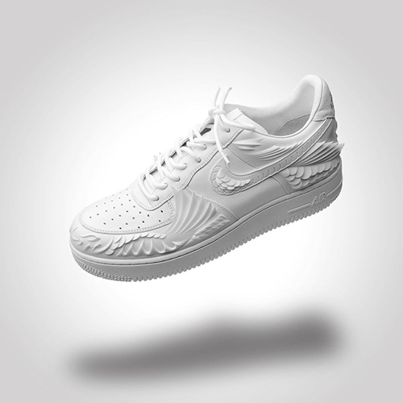

# 📓 关于 The Remade

创办人 Tommy 本身就是资深球鞋藏家，但年轻追逐市场一段时间后，他发现与其追逐别人的限量球鞋，不如自己设计独一无二的订制鞋。后来也正好搭上社群热潮，大家开始追求「个性化」，让 The Remade 的创作映入许多名人与品牌眼中。

<figure><figcaption>
Air Force 1 “Chinese Koi”
</figcaption></figure>

### 曾为公鹿队、周汤豪等名人订制球鞋

THE REMADE 曾为许多海内外名人订制专属球鞋，如 Chris Brown、Nelly、周汤豪、蒋友柏等；而近期比较知名的作品，应是为庆祝 NBA 「密尔瓦基公鹿队」上季睽违 50 年再度夺冠的纪念鞋。照片中可看见这双 AJ1，是以公鹿队配色打造、鞋身奢华地布满水钻，内侧印有「Fear the Deer」队标，鞋舌则为 CHAMPIONS 字样，做工超级精细！同时这也是 NBA 赛史上首双冠军鞋，推翻过去只有冠军戒的不成文规定。

<figure><figcaption>
公鹿队冠军鞋
</figcaption></figure>

### 不再只是二创，而是将在元宇宙推出「品牌原创作品」

过去 THE REMADE 主理人 Tommy Chen 所设计的订制球鞋，都是先买下 Nike、Adidas 等品牌的官方原作，再经由涂鸦、雷雕、换皮，甚至 3D 列印等手法来进行二创；而即将在元宇宙推出的「THE REMADE：E-DAMER 」NFT 同样也秉持着「订制」、「独一无二」原则，但鞋体本身应会是全手工打造，也就是 THE REMADE 或将推出「品牌原创作品」。

<figure><figcaption>
RE：DREAMER 鞋款
</figcaption></figure>
