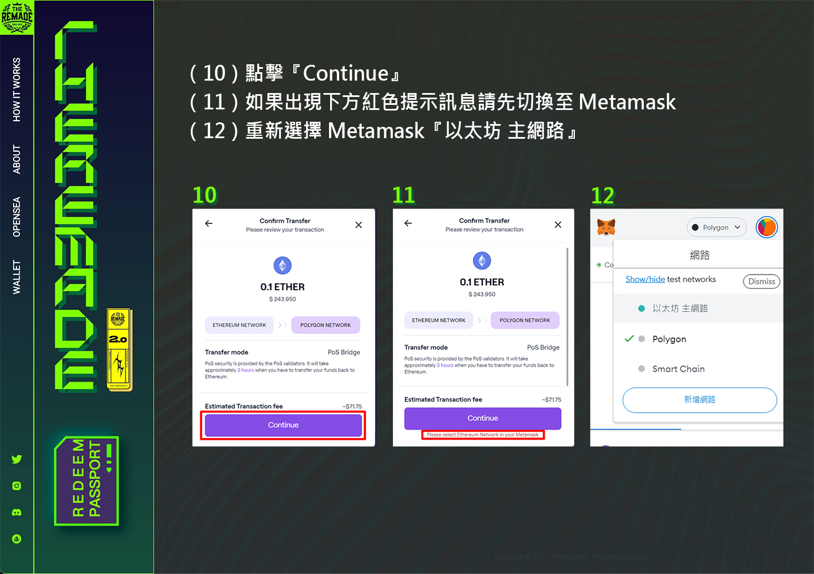

# 📓 關於 The Remade

創辦人 Tommy 本身就是資深球鞋藏家，但年輕追逐市場一段時間後，他發現與其追逐別人的限量球鞋，不如自己設計獨一無二的訂製鞋。後來也正好搭上社群熱潮，大家開始追求「個性化」，讓 The Remade 的創作映入許多名人與品牌眼中。

<figure><figcaption>
Air Force 1 “Chinese Koi”
</figcaption></figure>

### 曾為公鹿隊、周湯豪等名人訂製球鞋

THE REMADE 曾為許多海內外名人訂製專屬球鞋，如 Chris Brown、Nelly、周湯豪、蔣友柏等；而近期比較知名的作品，應是為慶祝 NBA 「密爾瓦基公鹿隊」上季睽違 50 年再度奪冠的紀念鞋。照片中可看見這雙 AJ1，是以公鹿隊配色打造、鞋身奢華地佈滿水鑽，內側印有「Fear the Deer」隊標，鞋舌則為 CHAMPIONS 字樣，做工超級精細！同時這也是 NBA 賽史上首雙冠軍鞋，推翻過去只有冠軍戒的不成文規定。

<figure><figcaption>
公鹿隊冠軍鞋
</figcaption></figure>

### 不再只是二創，而是將在元宇宙推出「品牌原創作品」

過去 THE REMADE 主理人 Tommy Chen 所設計的訂製球鞋，都是先買下 Nike、Adidas 等品牌的官方原作，再經由塗鴉、雷雕、換皮，甚至 3D 列印等手法來進行二創；而即將在元宇宙推出的「THE REMADE：E-DAMER 」NFT 同樣也秉持著「訂製」、「獨一無二」原則，但鞋體本身應會是全手工打造，也就是 THE REMADE 或將推出「品牌原創作品」。

<figure><figcaption>
RE：DREAMER鞋款
</figcaption></figure>
