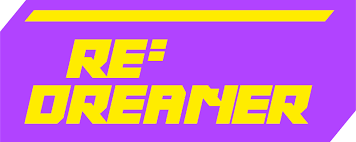
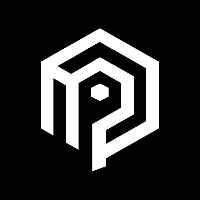
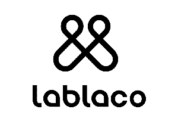

# 合作項目

## **RE：DREAMER**

<figure><figcaption></figcaption></figure>

區塊鏈新創公司 RE:DREAMER，打造了一款可以將 NFT 與零售商本來系統串接的「NFT兌換協議（Protocol）」，就像是在網站上串接 PayPal，不改變本來的工作流程，要把 Web3 的新概念，用 Web2 的熟悉感包裝。

官方網站：[https://www.redreamer.io/](https://www.redreamer.io/)

### DMTKZ

<figure><figcaption></figcaption></figure>

DMKTZ 已擁有 8 年數位服裝技術，並打造讓你無需擁有任何 3D 或設計師背景、皆能透過 DMKTZ 所提供的平台，無痛設計出擁有完整 3D 建模的新服飾，不但能穿著於 3D NFT 上，背後所使用的服飾打板技術，皆比照訪間服裝製程，因此隨時都能化身實體服裝！成就真正－時尚、你說了算，無庫存、真永續。

官方網站：[https://dmktz.io/](https://dmktz.io/)

LABLACO

<figure><figcaption></figcaption></figure>

LABLACO 平台創立於 2016 年，循環時尚結合科技，嘗試延長衣物使用壽命，幫助品牌利用新科技掌握資料、更容易與消費者建立連結的平台。平台用戶可以把不需要的衣服上傳至平台，若有其他用戶想要，只需付運費就可取得，類似二手交換。如果用戶在平台捐出商品，可積分兌換LABLACO貨幣，購買平台上的時尚單品。除此之外大型品牌也可以將未售出的商品進行升級改造-upcycle，或是時尚相關人士、KOL可利用平台分享多餘衣服，透過科技整合，讓產品流通有更多方式。\
