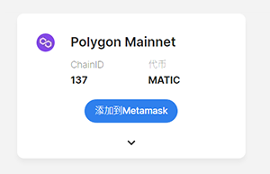
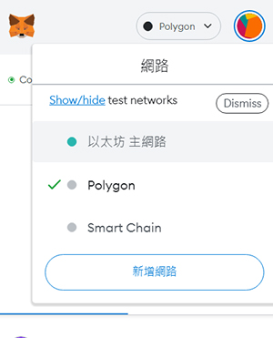

# ❓ How to add a Polygon chain

Metamask preset does not add Polygon chain (Matic), so you need to manually add Polygon Network related parameters：

01、Connect to [https://chainlist.org/ ](https://chainlist.org/)

02、Enter Polygon to search

03、Click "Add to Metamask" under Polygon Mainnet to complete the setting.&#x20;

<figure><figcaption></figcaption></figure>

04、After completing the addition of POLYGON NETWORK, the options in the picture below will appear and you can switch directly.

<figure><figcaption></figcaption></figure>

