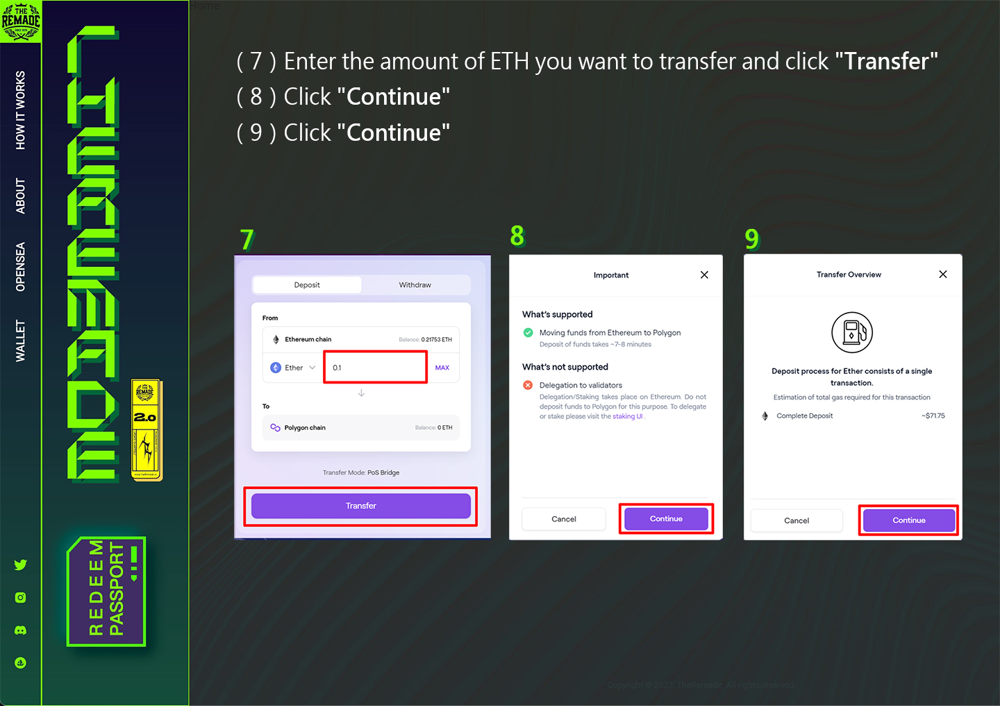
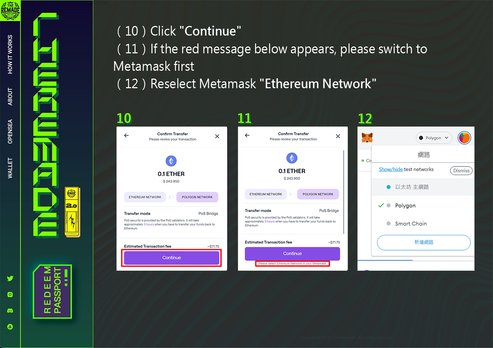
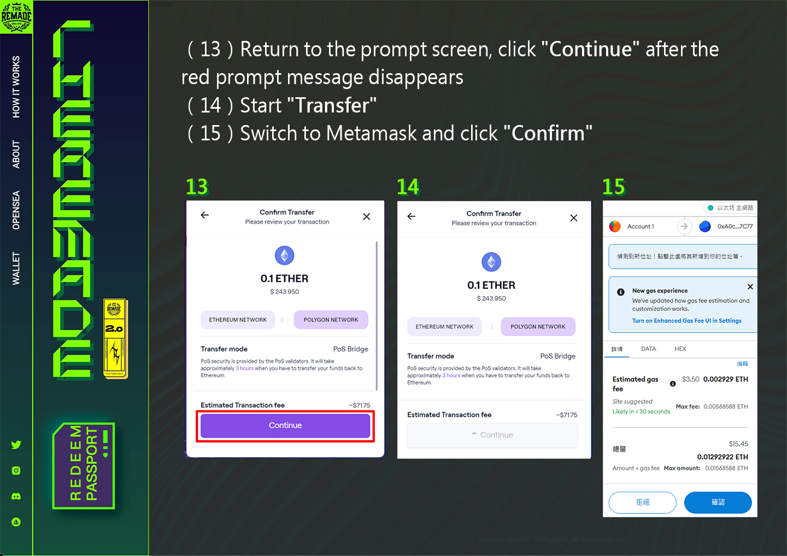
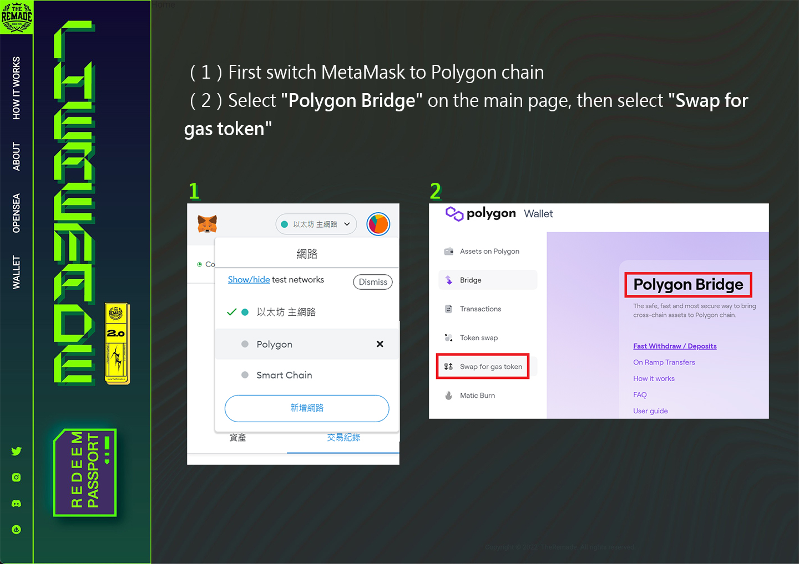
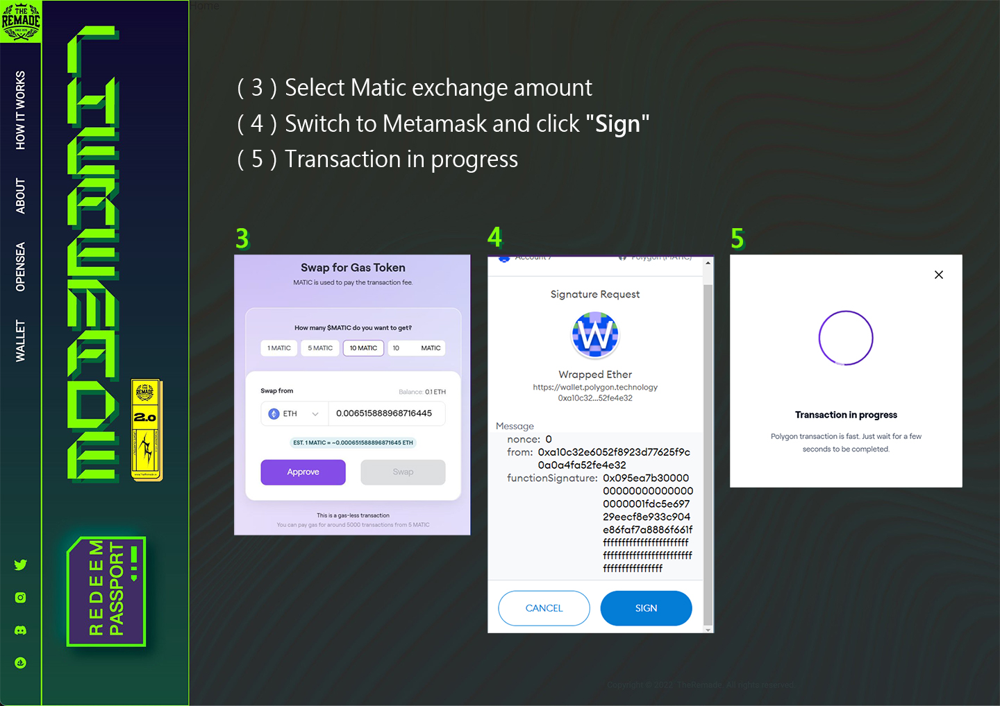
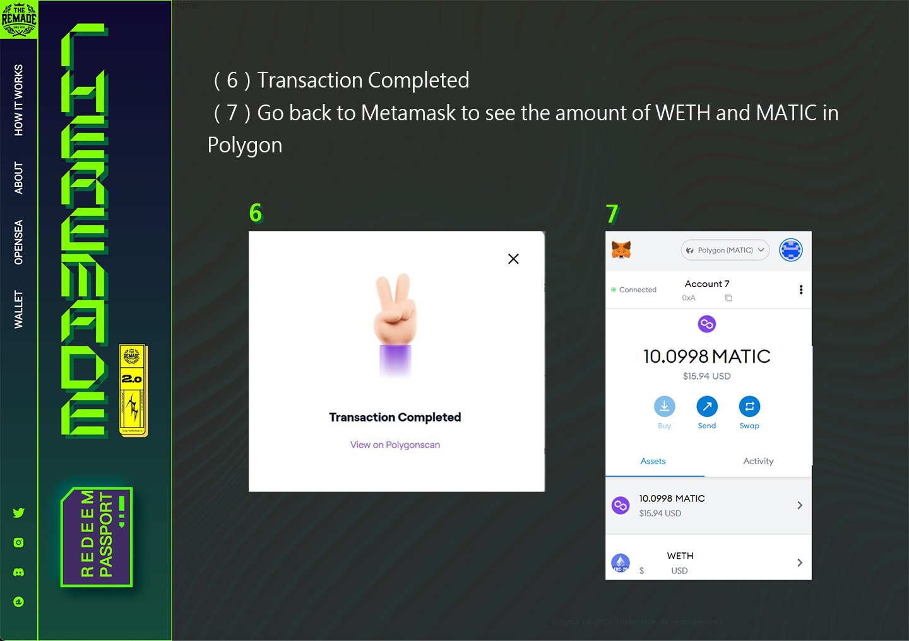

# ❓ How to Add Matic Coins to Wallet

## There are two ways to add Matic Coin (Polygon) to the wallet:

#### Method 1：

Buy Matic currency directly through cryptocurrency exchanges and transfer to the wallet address of the Polygon chain.

#### Method 2：

Convert ETH (ERC-20) to ETH (Polygon) through Polygon Web Wallet, and then use ETH (Polygon) to buy Matic, the following provides "Method 2" teaching.


It is recommended to use "Method 1", "Method 2" is more complicated.


## Steps to convert ETH (ERC-20) to ETH (Polygon)：

（1）Connect to Polygon Web Wallet （[https://wallet.polygon.technology/](https://wallet.polygon.technology/) ）&#x20;

（2）Click "Connect to a Wallet" in the upper right corner

（3）Select Metamask&#x20;

（4）Click Metamask "Sign"

<figure><figcaption></figcaption></figure>

<figure><figcaption></figcaption></figure>

<figure><figcaption></figcaption></figure>

<figure><figcaption></figcaption></figure>

<figure><figcaption></figcaption></figure>


The above steps only convert ETH from the Ethereum chain to the Polygon chain. The next step is to exchange Matic coins on the Polygon chain. When using RNFT to exchange, Matic coins are required as Gas!


## Steps to convert ETH (Polygon) to MATIC (Polygon)：

<figure><figcaption></figcaption></figure>

<figure><figcaption></figcaption></figure>

<figure><figcaption></figcaption></figure>
