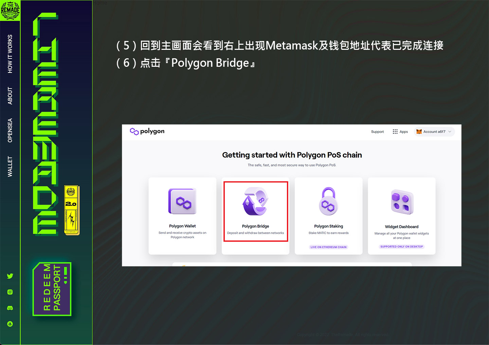
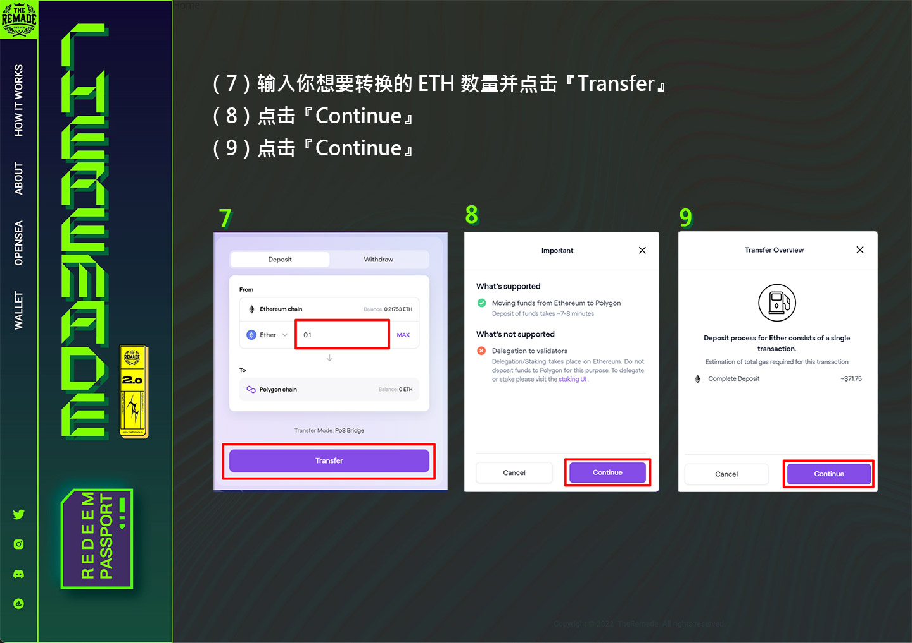
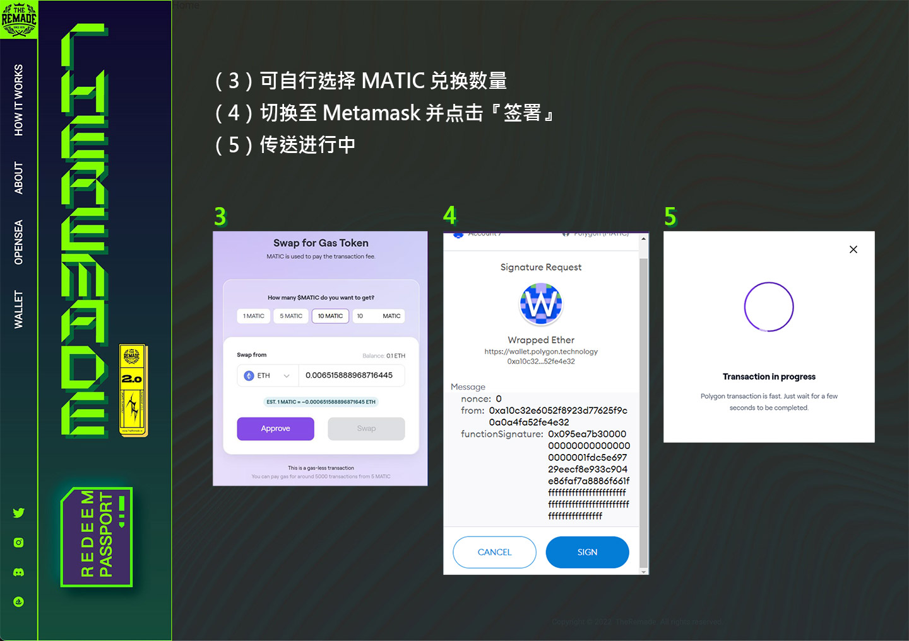

# ❓ 如何在钱包添加 Matic 币

### 添加 Matic 币 （Polygon）到钱包有两种方式：

#### 方法一：

透过加密货币交易所直接购买 Matic 货币，并转入至 Polygon 链的钱包地址

#### 方法二：

透过 Polygon Web Wallet 转换 ETH（ERC-20）到 ETH（Polygon），再使用 ETH（Polygon）购买 Matic ，以下提供「方法二」教学


建议使用「方法一」，「方法二」较为复杂


### 转换 ETH（ERC-20）到 ETH（Polygon）步骤：

（1）连上 Polygon Web Wallet （https://wallet.polygon.technology/ ）&#x20;

（2）点击右上角的『Connect to a Wallet』&#x20;

（3）选择 Metamask&#x20;

（4）点击 Metamask 『签署』

<figure><figcaption></figcaption></figure>

<figure><figcaption></figcaption></figure>

<figure><figcaption></figcaption></figure>

<figure><figcaption></figcaption></figure>

<figure><figcaption></figcaption></figure>


**以上步骤仅将 ETH 由乙太链转换至 Polygon 链**，接下去的步骤为 Polygon 链上兑换 Matic 币，使用 RNFT 兑换时需要 Matic 币当作 Gas！


### 转换 ETH（Polygon）到 MATIC（Polygon）步骤：

<figure><figcaption></figcaption></figure>

<figure><figcaption></figcaption></figure>

<figure><figcaption></figcaption></figure>
