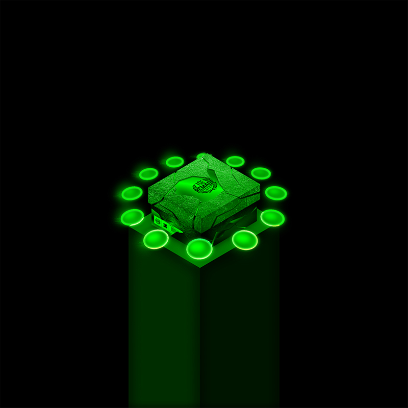
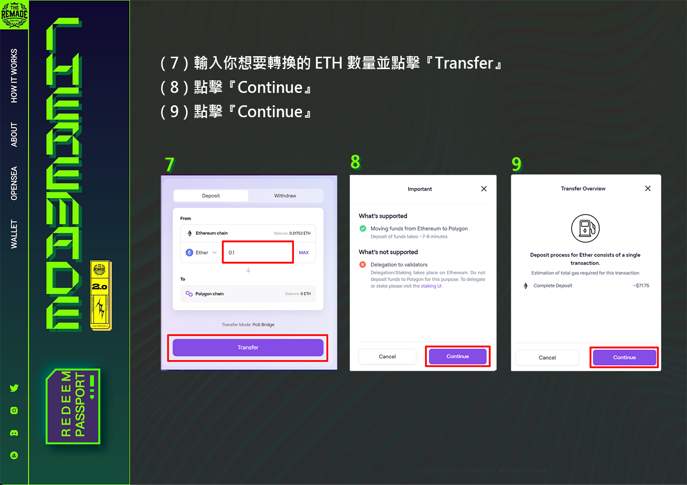
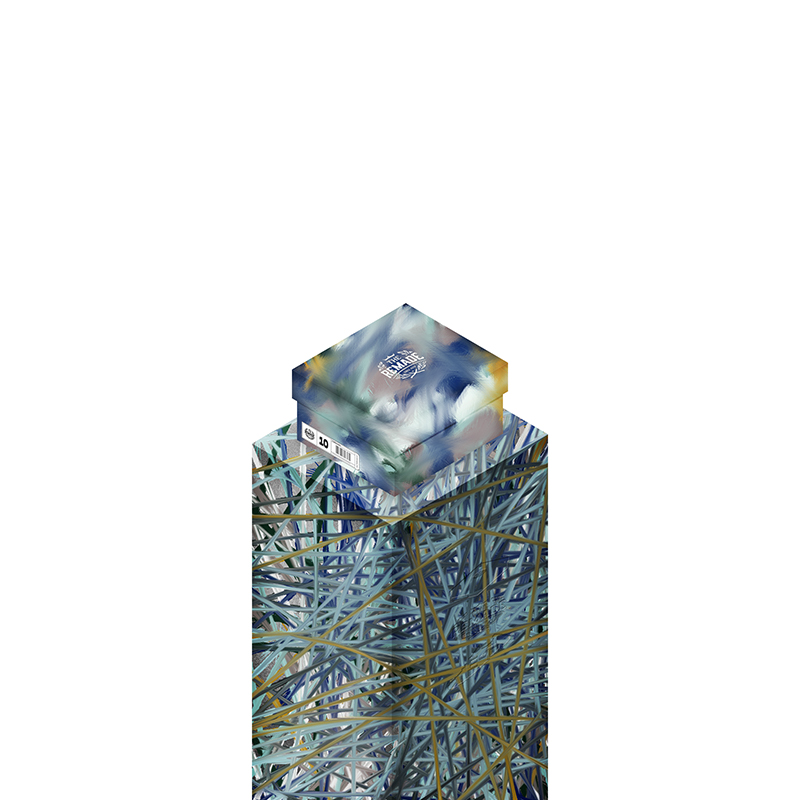

# 👑 Legendary Collection

Through the contract, it can be found that the project has 520 NFTs, but only 500 are actually sold, because the first 20 are the Legendary series. This series is reserved for future cooperation projects, and the first 10 cooperation projects have been released.

## Revealed Legendary

<figure><figcaption></figcaption></figure>

#### #5 Sneaker News

Sneaker News is a sports shoe media platform that reports on the most coveted and latest sports shoes on the market every day. In addition to regularly updating the latest news, Sneaker News also provides useful resources to help global consumers make purchases. Sneaker News is considered the most reliable and authoritative voice in the sneaker industry.

## Unreleased Legendary

<figure><figcaption>
Token ID 1
</figcaption></figure>

 

<figure><figcaption>
Token ID 2
</figcaption></figure>

<figure><figcaption>
Token ID 3
</figcaption></figure>

 

<figure><figcaption>
Token ID 4
</figcaption></figure>

<figure><figcaption>
Token ID 6
</figcaption></figure>

 

<figure><figcaption>
Token ID 7
</figcaption></figure>

<figure><figcaption>
Token ID 8
</figcaption></figure>

 

<figure><figcaption>
Token ID 9
</figcaption></figure>

<figure><figcaption>
Token ID 10
</figcaption></figure>

 

<figure><figcaption>
Token ID 11~20
</figcaption></figure>

