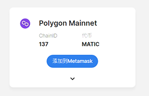
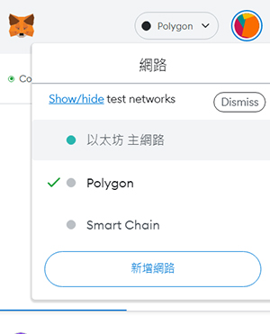

# 🧑🏫 Polygon 鏈相關教學



### Metamask 预设并未添加 Polygon 链（Matic），所以需要手动新增 Polygon Network 相关的参数：

01、连接至 https://chainlist.org/

02、输入 Polygon 搜寻

03、点击 Polygon Mainnet 下方的『添加到 Metamask』完成设定

<figure><figcaption></figcaption></figure>

04、完成新增 POLYGON NETWORK 之后就会出现下方图片的选项可直接进行切换

<figure><figcaption></figcaption></figure>



### 添加 Matic 币 （Polygon）到钱包有两种方式：&#x20;

#### 方法一：

透过加密货币交易所直接购买 Matic 货币，并转入至 Polygon 链的钱包地址&#x20;

#### 方法二：

透过 Polygon Web Wallet 转换 ETH（ERC-20）到 ETH（Polygon），再使用 ETH（Polygon）购买 Matic ，以下提供「方法二」教学


建议使用「方法一」，「方法二」较为复杂


### 转换 ETH（ERC-20）到 ETH（Polygon）步骤：

（1）连上 Polygon Web Wallet （https://wallet.polygon.technology/ ）&#x20;

（2）点击右上角的『Connect to a Wallet』&#x20;

（3）选择 Metamask&#x20;

（4）点击 Metamask 『签署』

<figure><figcaption></figcaption></figure>

<figure><figcaption></figcaption></figure>

<figure><figcaption></figcaption></figure>

<figure><figcaption></figcaption></figure>

<figure><figcaption></figcaption></figure>


**以上步骤仅将 ETH 由乙太链转换至 Polygon 链**，接下去的步骤为 Polygon 链上兑换 Matic 币，使用 RNFT 兑换时需要 Matic 币当作 Gas ！


### 转换 ETH（Polygon）到 MATIC（Polygon）步骤：

<figure><figcaption></figcaption></figure>

<figure><figcaption></figcaption></figure>

<figure><figcaption></figcaption></figure>


