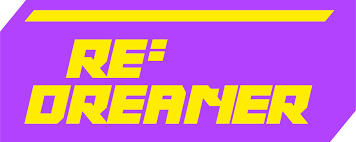

# 🤜 企业合作

## **RE：DREAMER**

<figure><figcaption></figcaption></figure>

区块链新创公司 RE:DREAMER，打造了一款可以将 NFT 与零售商本来系统串接的「NFT兑换协议（Protocol）」，就像是在网站上串接 PayPal，不改变本来的工作流程，要把 Web3 的新概念，用 Web2 的熟悉感包装。

官方网站：[https://www.redreamer.io/](https://www.redreamer.io/)

### DMTKZ

<figure><figcaption></figcaption></figure>

DMKTZ 已拥有 8 年数位服装技术，并打造让你无需拥有任何 3D 或设计师背景、皆能透过 DMKTZ 所提供的平台，无痛设计出拥有完整 3D 建模的新服饰，不但能穿着于 3D NFT 上，背后所使用的服饰打板技术，皆比照访间服装制程，因此随时都能化身实体服装！成就真正－时尚、你说了算，无库存、真永续。

官方网站：[https://dmktz.io/](https://dmktz.io/)

### LABLACO

<figure><figcaption></figcaption></figure>

LABLACO 平台创立于 2016 年，循环时尚结合科技，尝试延长衣物使用寿命，帮助品牌利用新科技掌握资料、更容易与消费者建立连结的平台。平台用户可以把不需要的衣服上传至平台，若有其他用户想要，只需付运费就可取得，类似二手交换。如果用户在平台捐出商品，可积分兑换LABLACO货币，购买平台上的时尚单品。除此之外大型品牌也可以将未售出的商品进行升级改造-upcycle，或是时尚相关人士、KOL可利用平台分享多余衣服，透过科技整合，让产品流通有更多方式。

官方网站：[https://lablaco.com/](https://lablaco.com/)
