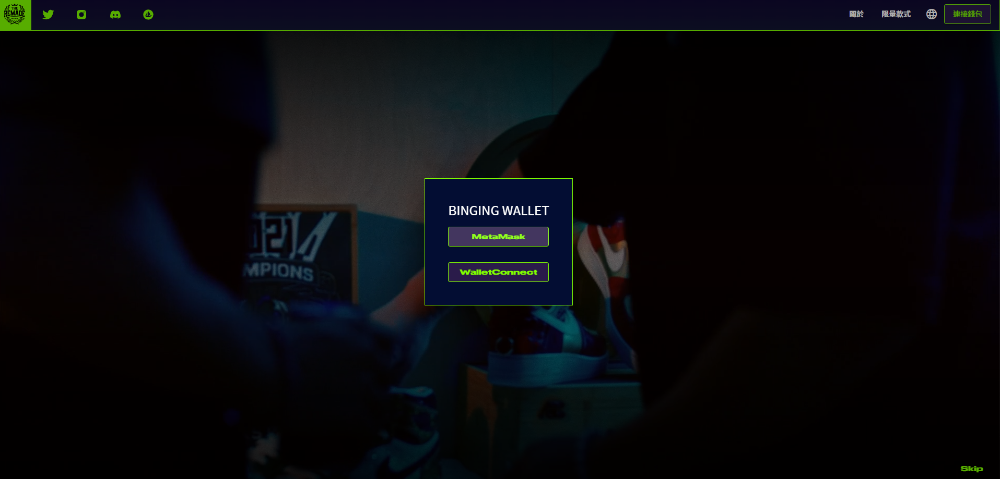
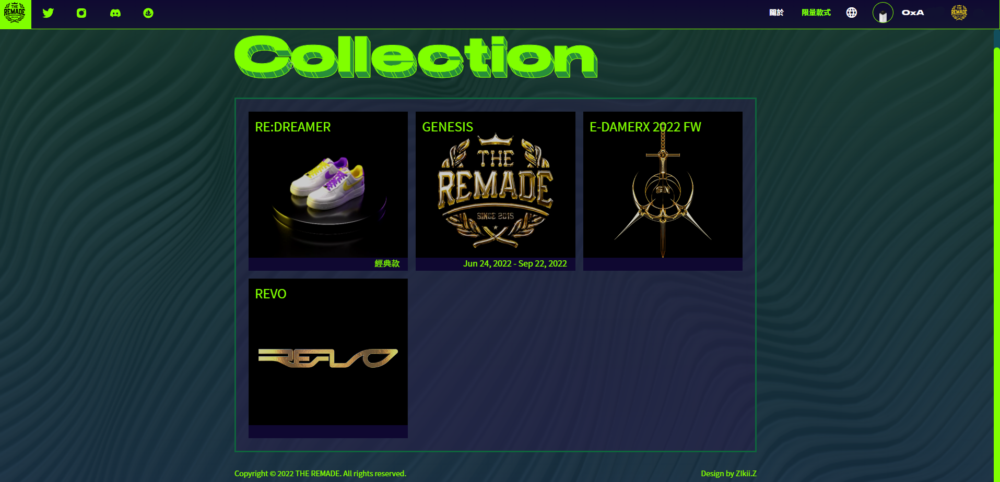
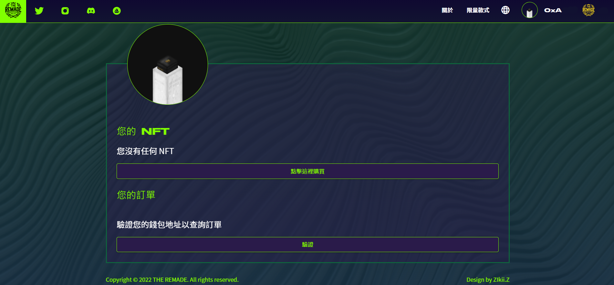

# ❓ RNFT 兌換教學與 Q\&A



### 第一步：進入官網後，點選右上角的連結錢包，就會進入下方的畫面進行登入

<figure><figcaption></figcaption></figure>

###

### 第二步：登入後點選右上角的**限量款式**，就可以進入下方畫面進行商品兌換

<figure><figcaption></figcaption></figure>

### 第三步：使用 RNFT 進行兌換

<figure><figcaption></figcaption></figure>

### 第四步：填寫兌換尺寸與貨運寄送地址，填寫完成後會需要燒掉 RNFT，完成

<figure><figcaption></figcaption></figure>




### 01、請問怎麼將錢包切換到 Polygon 鏈？

可以參考 如何在錢包添加 Matic 幣 頁面

### 02、該如何知道適合自己的鞋碼？

第一季鞋款為 Air Force 1 拆改設計，可參考下表或直接到 NIKE 官網查詢鞋碼，也可至實體店面試穿該鞋款。[https://www.nike.com/size-fit/mens-footwear](https://www.nike.com/size-fit/mens-footwear)

<figure><figcaption></figcaption></figure>

### 03、請問鞋碼是否有分男女鞋？需要備註嗎？

鞋碼沒有男女鞋之分，可以直接參考官網的尺碼用 US 或 CM 去對應 EU。

### 04、兌換時顯示沒有足夠的 MATIC 可進行交易該怎麼解決？

Matic 是 Polygon 鏈的原生代幣就跟 ETH 在 Ethereum 鏈一樣，可到交易所購買 MATIC 再轉入存有 RNFT 的錢包裡即可進行操作。

### 05、錢包內有Matic 但還是兌換失敗該怎麼辦？ 例如下圖的狀況

<figure><figcaption></figcaption></figure>

**建議調高 Gas 到 High 即可。**

### 06、兌換完成後哪裡可以檢查是否已兌換成功？

兌換完成可以到官網查詢。同時也可以在 Discord 裡的 #redeem-events 檢查是否出現自己的地址。

<figure><figcaption></figcaption></figure>

### 07、兌換後多久可以收到商品？

按填寫順序陸續寄出，約 8 周左右會收到商品。

### 08、請問每次的鞋款是否有兌換期限？

有，連結官網出現兌換頁面後，將在每款鞋子圖片底端顯示兌換期限。

### 09、若 RNFT 過多是否可以保留到下一季兌換？

可以，RNFT 無使用期限，若錯過當季商品可將剩餘 RNFT 保留至下次兌換。

### 10、如果有想換的鞋款但沒有足夠的 RNFT？

可以到二級市場（OpenSea）購買。連結可以參考『官方連結』頁面。

### 11、若尺碼不小心選錯是否可以更改？

可以，請在兌換的當週六前開票並提供錢包地址及相關修改資料即可，逾時不受理。


