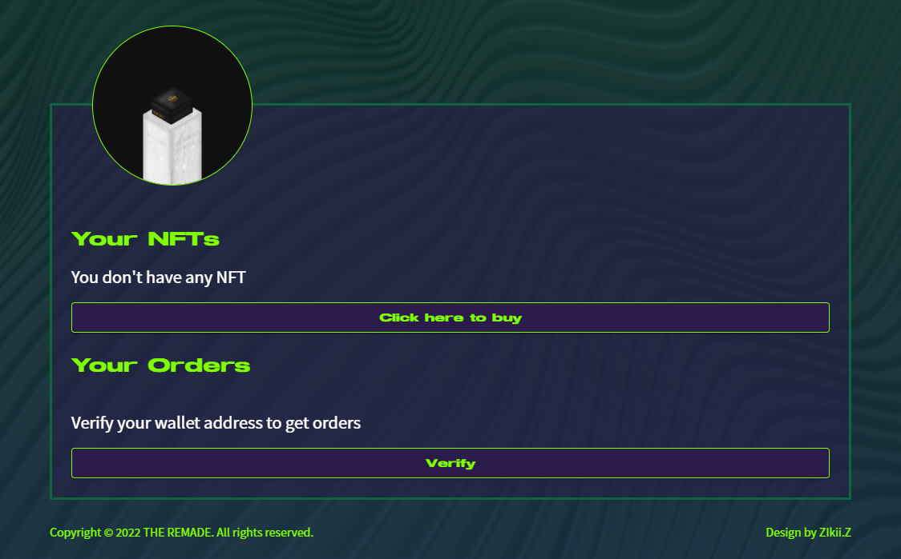

# ❓ RNFT redemption issues

### 01、How can I switch my wallet to the Polygon chain?

You can refer to the [How to Add Matic Coins to Wallet](how-to-add-a-polygon-chain.md) page

### 02、How do I know which shoe size is right for me?

This season's shoes are designed for Air Force 1 disassembly and modification. You can directly refer to the official website shoe size to buy, or go to the physical store to interview and wear the shoes. [https://www.nike.com/size-fit/mens-footwear](https://www.nike.com/size-fit/mens-footwear)

<figure><figcaption></figcaption></figure>

### 03、Is the shoe size divided into men's and women's shoes?

You can directly refer to the size of the official website, and use US to correspond to EU.

### 04、What should I do if the page shows that there is not enough MATIC to make a transaction during exchange?

Matic is the native token of the Polygon chain, just like ETH in the Ethereum chain. You can buy MATIC on the exchange and then transfer it in to operate.

### 05、What should I do if I have Matic in my wallet but the exchange fails?

<figure><figcaption></figcaption></figure>

It is recommended to increase the Gas to high.

### 06、After the redemption is completed, where can I check whether the redeem has succeed?

After redeeming, you can check the status on the official website.

<figure><figcaption></figcaption></figure>

### 07、How long can I receive the product after redemption?

It will be sent out in the order filled in, and it will take about 8 weeks to receive the items.

### 08、Is there a redemption period for each season's shoes?

Yes, after linking the official website to the redemption page, the redemption period will be displayed at the bottom of each shoe picture.

### 09、Can RNFT be held until next season for redemption?

Yes, RNFT has no expiration date

### 10、Want to change a lot of shoes but not enough RNFT?

You can go to the secondary market (OpenSea) to buy. Refer to the [Official Links](official-link.md) page.

### 11、Can I change the size if I accidentally choose the wrong size?

Yes, please provide the wallet address to the mod by creating ticket before the Saturday of the redemption.

