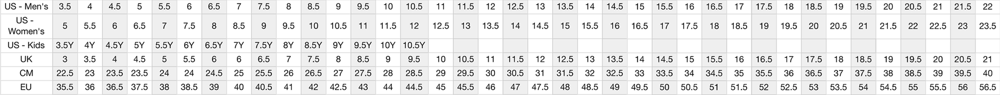
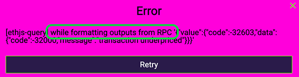

# ❓ RNFT 兌換相關問題

### 01、領到 RNFT 後如何兌換商品？

到官網後先將錢包切換至 Polygon 鏈，點選左側的錢包連結，出現商品後即可使用RNFT兌換，填寫收件資訊及尺碼後送出，經過 Polygon 鏈燃燒 RNFT 後就完成。

<figure><figcaption></figcaption></figure>

### 02、我的錢包連上後未出現商品該如何解決？

請先確認是否將錢包切換至 Polygon 鏈。

### 03、請問怎麼將錢包切換到 Polygon 鏈？

可以參考 如何在錢包添加 Matic 幣 頁面

### 04、使用冷錢包並已切換到 Polygon 鏈但一直失敗或連結後沒有出現商品怎麼辦？

若使用冷錢包者，建議先將RNFT轉移至熱錢包後再兌換，目前冷錢包種類較多我們團隊尚在更新系統，未來能讓更多冷錢包持有者順利兌換。

### 05、兌換網站都是英文，請問收件資料可以填中文嗎？

中文地區建議填中文資料，方便配送人員處理。

### 06、該如何知道適合自己的鞋碼？

第一季鞋款為 Air Force 1 拆改設計，可參考下表或直接到 NIKE 官網查詢鞋碼，也可至實體店面試穿該鞋款。[https://www.nike.com/size-fit/mens-footwear](https://www.nike.com/size-fit/mens-footwear)

<figure><figcaption></figcaption></figure>

### 07、請問鞋碼是否有分男女鞋？需要備註嗎？

鞋碼沒有男女鞋之分，可以直接參考官網的尺碼用US或CM去對應EU。

### 08、兌換時顯示沒有足夠的 MATIC 可進行交易該怎麼解決？

Matic 是 Polygon 鏈的原生代幣就跟 ETH 在 Ethereum 鏈一樣，可到交易所購買 MATIC 再轉入存有 RNFT 的錢包裡即可進行操作。

### 09、錢包內有Matic 但還是兌換失敗該怎麼辦？ 例如下圖的狀況

<figure><figcaption></figcaption></figure>

**建議調高 Gas 到 High 即可。**

### 10、兌換完成後哪裡可以檢查是否已兌換成功？

此功能目前開發中，若RNFT數量有減少即代表兌換成功。目前可以在 Discord 裡的 #redeem-events 檢查是否出現自己的地址。

### 11、兌換後多久可以收到商品？

按填寫順序陸續寄出，約 6 周左右會收到商品。

### 12、請問每季的鞋款是否有兌換期限？

有，連結官網出現兌換頁面後，將在每款鞋子圖片底端顯示兌換期限。

### 13、ASRNFT 是否可以保留至下一季商品兌換？

ASRNFT 目前僅能兌換本次芝加哥鞋款，兌換期限過後將無法再兌換其他商品。

### 14、若 RNFT 過多是否可以保留到下一季兌換？

可以，RNFT 無使用期限，若錯過當季商品可將剩餘 RNFT 保留至下次兌換。

### 15、想換的鞋款很多但沒有足夠的 RNFT？

可以到二級市場（OpenSea）購買。連結可以參考『官方連結』頁面。

### 16、若尺碼不小心選錯是否可以更改？

可以，請在兌換的當週六前開票並提供錢包地址及相關修改資料即可，逾時不受理。

