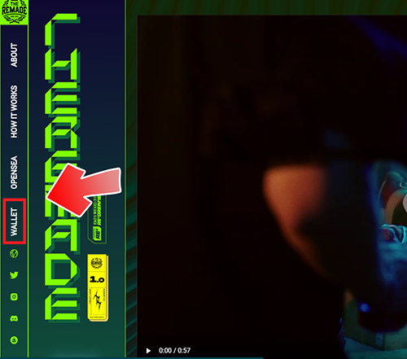

# ❓ RNFT 兑换相关问题

### 01、领到 RNFT 后如何兑换商品？

到官网后先将钱包切换至 Polygon 链，点选左侧的钱包连结，出现商品后即可使用RNFT兑换，填写收件资讯及尺码后送出，经过 Polygon 链燃烧 RNFT 后就完成。

<figure><figcaption></figcaption></figure>

### 02、我的钱包连上后未出现商品该如何解决？

请先确认是否将钱包切换至 Polygon 链。

### 03、请问怎么将钱包切换到 Polygon 链？

可以参考 如何在钱包添加 Matic 币 页面

### 04、使用冷钱包并已切换到 Polygon 链但一直失败或连结后没有出现商品怎么办？

若使用冷钱包者，建议先将RNFT转移至热钱包后再兑换，目前冷钱包种类较多我们团队尚在更新系统，未来能让更多冷钱包持有者顺利兑换。

### 05、兑换网站都是英文，请问收件资料可以填中文吗？

中文地区建议填中文资料，方便配送人员处理。

### 06、该如何知道适合自己的鞋码？

第一季鞋款为 Air Force 1 拆改设计，可参考下表或直接到 NIKE 官网查询鞋码，也可至实体店面试穿该鞋款。[https://www.nike.com/size-fit/mens-footwear](https://www.nike.com/size-fit/mens-footwear)

<figure><figcaption></figcaption></figure>

### 07、请问鞋码是否有分男女鞋？需要备注吗？

鞋码没有男女鞋之分，可以直接参考官网的尺码用US或CM去对应EU。

### 08、兑换时显示没有足够的 MATIC 可进行交易该怎么解决？

Matic 是 Polygon 链的原生代币就跟 ETH 在 Ethereum 链一样，可到交易所购买 MATIC 再转入存有 RNFT 的钱包里即可进行操作。

### 09、钱包内有Matic 但还是兑换失败该怎么办？例如下图的状况

<figure><figcaption></figcaption></figure>

**建议调高 Gas 到 High 即可。**

### 10、兑换完成后哪里可以检查是否已兑换成功？

此功能目前开发中，若RNFT数量有减少即代表兑换成功。目前可以在 Discord 里的 #redeem-events 检查是否出现自己的地址。

### 11、兑换后多久可以收到商品？

按填写顺序陆续寄出，约 6 至8周会收到商品。

### 12、请问每季的鞋款是否有兑换期限？

有，连结官网出现兑换页面后，将在每款鞋子图片底端显示兑换期限。

### 13、ASRNFT 是否可以保留至下一季商品兑换？

ASRNFT 目前仅能兑换本次芝加哥鞋款，兑换期限过后将无法再兑换其他商品。

### 14、若 RNFT 过多是否可以保留到下一季兑换？

可以，RNFT 无使用期限，若错过当季商品可将剩余 RNFT 保留至下次兑换。

### 15、想换的鞋款很多但没有足够的 RNFT？

可以到二级市场（OpenSea）购买。连结可以参考『官方连结』页面。

### 16、若尺码不小心选错是否可以更改？

可以，请在兑换的当周六前开票并提供钱包地址及相关修改资料即可，逾时不受理。

