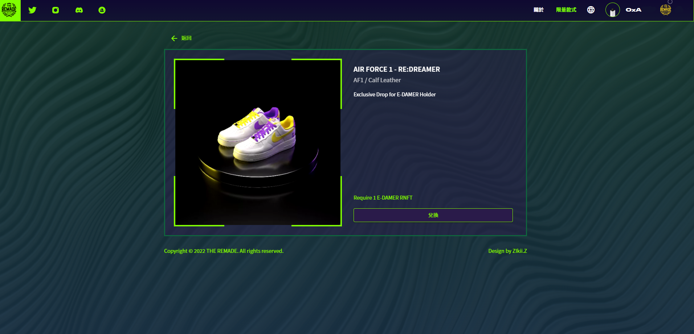

# 📚 RNFT 兌換教學

### 第一步：進入官網後，點選右上角的連結錢包，就會進入下方的畫面進行登入

<figure><figcaption></figcaption></figure>

### 第二步：登入後點選右上角的**限量款式**，就可以進入下方畫面進行商品兌換

<figure><figcaption></figcaption></figure>

### 第三步：使用 RNFT 進行兌換

<figure><figcaption></figcaption></figure>

### 第四步：填寫兌換尺寸與貨運寄送地址，填寫完成後會需要燒掉 RNFT，成功完成

<figure><figcaption></figcaption></figure>
