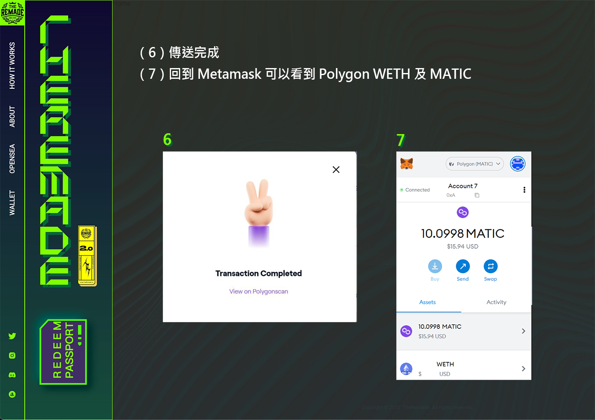

# ❓ 如何在錢包添加 Matic 幣

### 添加 Matic 幣 （Polygon）到錢包有兩種方式：

#### 方法一：

透過加密貨幣交易所直接購買 Matic 貨幣，並轉入至 Polygon 鏈的錢包地址

#### 方法二：

透過 Polygon Web Wallet 轉換 ETH（ERC-20）到 ETH（Polygon），再使用 ETH（Polygon）購買 Matic ，以下提供「方法二」教學


**建議使用「方法一」，「方法二」較為複雜**


### 轉換 ETH（ERC-20）到 ETH（Polygon）步驟：

（1）連上 Polygon Web Wallet （https://wallet.polygon.technology/ ）&#x20;

（2）點擊右上角的『Connect to a Wallet』&#x20;

（3）選擇 Metamask&#x20;

（4）點擊 Metamask 『簽署』

<figure><figcaption></figcaption></figure>

<figure><figcaption></figcaption></figure>

<figure><figcaption></figcaption></figure>

<figure><figcaption></figcaption></figure>

<figure><figcaption></figcaption></figure>


**以上步驟僅將 ETH 由乙太鏈轉換至 Polygon 鏈**，接下去的步驟為 Polygon 鏈上兌換 Matic 幣，使用 RNFT 兌換時需要 Matic 幣當作 Gas ！


### 轉換 ETH（Polygon）到 MATIC（Polygon）步驟：

<figure><figcaption></figcaption></figure>

<figure><figcaption></figcaption></figure>

<figure><figcaption></figcaption></figure>
